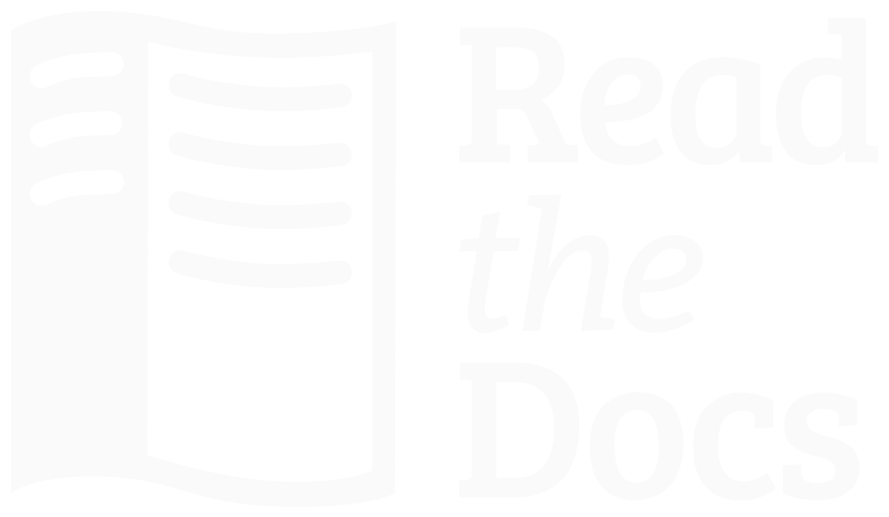

Branding Guidelines
===================

Acceptable use
--------------

Read the Docs logos and other trademarks are available for use under the
`CC-BY 4.0` license. This license is valid as long as you **do not**:

* alter our logos in any way
* place a logo in such close proximity to other content that it is
  indistinguishable
* make our logo the most distinctive or prominent feature on your website,
  printed material or other content
* use our logos in a way that suggests any type of association or partnership
  with Read the Docs, Inc. or approval, sponsorship or endorsement by Read the
  Docs, Inc. (unless allowed via a license from us)
* use our logos in a way that is harmful, deceptive, obscene or otherwise
  objectionable to the average person
* use our logos on websites or other places containing content associated with
  hate speech, pornography, gambling or illegal activities
* use our logos to, or in connection with, content that disparages us or sullies
  our reputation

Brand name
----------

Our brand name is officially **Read the Docs**. If you want to use an acronym after defining the full brand name, you should use **RTD**.

Logos
-----

.. image:: ../assets/logo-dark.png
    :width: 200px

:Use: Dark color logo for use on light colors
:License: `CC-BY 4.0`
:SVG: :download:`logo-dark.svg <../assets/logo-dark.svg>`
:PNG: :download:`logo-dark.png <../assets/logo-dark.png>`

:Use: Light color logo for use on dark colors
:License: `CC-BY 4.0`
:SVG: :download:`logo-light.svg <../assets/logo-light.svg>`
:PNG: :download:`logo-light.png <../assets/logo-light.png>`

:Use: Dark color logo and wordmark for use on light colors
:License: `CC-BY 4.0`
:SVG: :download:`logo-wordmark-dark.svg <../assets/logo-wordmark-dark.svg>`
:PNG: :download:`logo-wordmark-dark.png <../assets/logo-wordmark-dark.png>`

:Use: Light color logo and wordmark for use on dark colors
:License: `CC-BY 4.0`
:SVG: :download:`logo-wordmark-light.svg <../assets/logo-wordmark-light.svg>`
:PNG: :download:`logo-wordmark-light.png <../assets/logo-wordmark-light.png>`

:Use: Dark color vertical logo and wordmark for use on light colors
:License: `CC-BY 4.0`
:SVG: :download:`logo-wordmark-dark.svg <../assets/logo-wordmark-dark.svg>`
:PNG: :download:`logo-wordmark-dark.png <../assets/logo-wordmark-dark.png>`

:Use: Light color vertical logo and wordmark for use on dark colors
:License: `CC-BY 4.0`
:SVG: :download:`logo-wordmark-light.svg <../assets/logo-wordmark-light.svg>`
:PNG: :download:`logo-wordmark-light.png <../assets/logo-wordmark-light.png>`

:Use: Dark color vertically compact logo and wordmark for use on light colors
:License: `CC-BY 4.0`
:SVG: :download:`logo-wordmark-dark.svg <../assets/logo-wordmark-dark.svg>`
:PNG: :download:`logo-wordmark-dark.png <../assets/logo-wordmark-dark.png>`

:Use: Light color vertically compact logo and wordmark for use on dark colors
:License: `CC-BY 4.0`
:SVG: :download:`logo-wordmark-light.svg <../assets/logo-wordmark-light.svg>`
:PNG: :download:`logo-wordmark-light.png <../assets/logo-wordmark-light.png>`

License
-------

All content, including this guideline, are, except where noted, available under
the `CC-BY 4.0`_ copyright license. This guideline is adapted from the
`Firefox Branding Guideline`_

.. _CC-BY 4.0: http://creativecommons.org/licenses/by/4.0/
.. _Firefox Branding Guideline: https://www.mozilla.org/en-US/styleguide/identity/firefox/branding/
